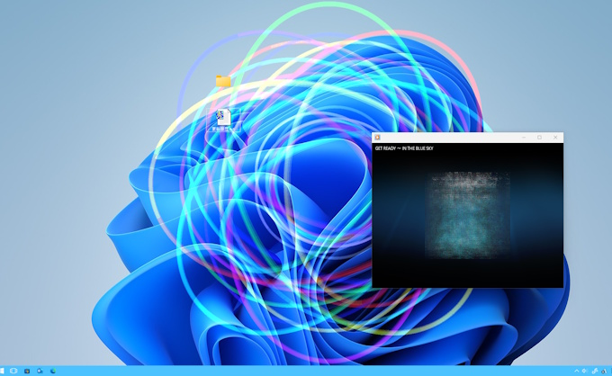
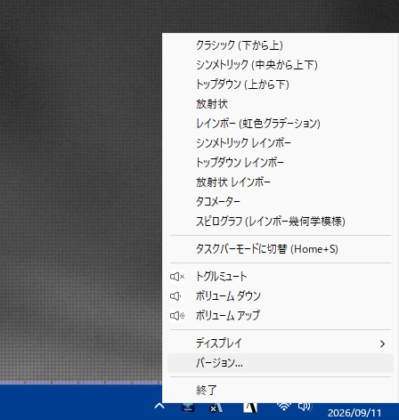
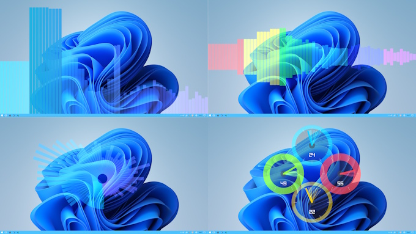
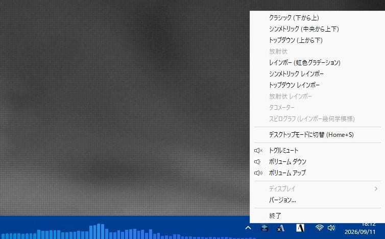

🌐 [English](./README.md)|**日本語**

# 🎨 Wallpaper Audio Visualizer

  
**「PCで聴いている音楽を、デスクトップの壁紙で光らせる。」**

Wallpaper Audio Visualizerは、PCで流れる音楽に合わせて、デスクトップの壁紙上で美しいアニメーションが躍動するアプリです。

## ✨ このアプリの魅力

- **音楽を「視覚」で楽しむ**  
  聴いている音楽のテンポや音量に合わせて、波形や幾何学模様がリアルタイムに反応します。
- **デスクトップ操作を邪魔しない「背面」設計**  
  アニメーションはデスクトップの「すぐ裏側」で動作します。**デスクトップ上のアイコンをダブルクリックしたり、ファイルをドラッグ＆ドロップしたりといった普段の操作は、アプリがない時と全く同じように行えます。**
- **省スペースな「タスクバーモード」対応**  
  デスクトップ全体だけでなく、タスクバー内へコンパクト（幅500px）に埋め込んで表示することも可能です。
- **10種類の多彩なスタイル**  
  定番の波形バーから、虹色に光る幾何学模様、スピードメーターを模したクールなデザインまで、その時の気分に合わせて選べます。
- **マルチモニター対応**  
  複数のモニターを使用している場合でも、お好みのモニターを指定して表示できます。

## 🚀 はじめ方

1.  **起動**: アプリのフォルダにある `wall-audio-visualizer.exe` をダブルクリックして実行してください。
2.  **セットアップ**: アプリが自動的にデスクトップの壁紙レイヤーへ移動します（起動直後に数秒ほどデスクトップが変化しますが、正常な動作ですのでそのままお待ちください）。
3.  **音楽を再生**: YouTube、Spotify、iTunesなどで音楽を再生すると、すぐに反応が始まります。

## 🛠 使いかた

アプリを起動すると、画面右下のタスクトレイにアイコンが表示されます。

- **スタイルの変更**: アイコンを**右クリック**するとメニューが開きます。「クラシック」「レインボー」「スピログラフ」など、好きなスタイルを選択してください。
- **タスクバーモード切替**: メニューの「タスクバーモードに切替」を選択すると、タスクバー内にコンパクトに埋め込んで表示できます。
- **表示モニターの切り替え**: メニューの「ディスプレイ」から、アニメーションを表示させたいモニターを選択できます（デスクトップモード時のみ）。
- **アプリの終了**: メニューの「終了」をクリックすると、アプリを完全に停止できます。

### ⌨️ 便利なショートカットキー

マウスを使わなくても、他のアプリに干渉すること無くキーボードで素早く操作できます。  
Homeキーを押しながら、各キーを押してください。

- **[Home] キー + [S] キー**: デスクトップモードとタスクバーモードを相互にトグル切り替えします。
  - タスクバーモード時は自動的に定番の「クラシック」スタイルでコンパクト（幅500px）に埋め込まれます。
  - 再度切り替えると、元のモニター・元のスタイルへ自動復帰します。
- **[Home] キー + [0] 〜 [9] キー**: 表示スタイルを瞬時に切り替えます（タスクバーモード時は一部スタイルが無効化されます）。
- **[Home] キー + [ESC] キー**: アプリをすぐに終了します。

※アプリの起動中は他アプリとの干渉を避けるため、Homeキーをフックします。そのため、キーボードのHomeキー本来の機能（カーソルの先頭移動等）は使えなくなります。

## 🎨 エフェクトの種類（全10スタイル）

気分に合わせて選べる多彩な表示スタイルを用意しています。

1.  **クラシック**: ピアノの鍵盤のように、下から上へリズムに合わせてバーが伸びる定番のスタイルです。
2.  **シンメトリック**: 画面中央から上下に鏡合わせのように広がる、バランスの取れた美しいスタイルです。
3.  **トップダウン**: 天井から光が降り注ぐように、上から下へバーが伸びるユニークなスタイルです。
4.  **放射状**: 画面中央から外側に向かって円形に花が咲くように反応する、近未来的なスタイルです。
5.  **レインボー**: 定番のバーグラフが、鮮やかな虹色のグラデーションで彩られます。
6.  **シンメトリック・レインボー**: 中央から広がる動きに、虹色の変化が加わった華やかなスタイルです。
7.  **トップダウン・レインボー**: 上から降り注ぐ光が七色に輝く、幻想的なスタイルです。
8.  **放射状・レインボー**: 円形に広がる光が時間とともに色を変えていく、最も派手なスタイルの一つです。
9.  **タコメーター**: 車のスピードメーターのような針が、音楽のビート（低音）に合わせて激しく振れるメカニカルなスタイルです。
10. **スピログラフ**: 万華鏡や定規で描いた幾何学模様のように、複雑な線が重なり合って変化し続ける幻想的なスタイルです。

## 🎉 新機能 タスクバーモード

タスクバー内へコンパクトに埋め込んで表示します。

  - ※タスクバーが左右配置の場合はタスクバーモードを利用できません。
  - **※Windowsのバージョンによる挙動の違い**:
    - **Windows 10**: タスクバー内の領域（ReBarWindow32）が自動調整され、アプリアイコンと重ならずに綺麗に収まります。
    - **Windows 11**: タスクバーの仕様上、配置によっては**タスクバー上のアプリアイコンとビジュアライザーの表示が重なってしまう**場合があります。あらかじめご了承ください。

> ※タスクバーモード時は、高さが限られた領域でも綺麗に視認できるよう、横長表示に適したスタイル（1〜3、5〜7）のみ利用可能です。放射状・タコメーター・スピログラフ（4, 8, 9, 10）は無効化されます。

## 💡 よくある質問

- **Q. デスクトップのアイコンがクリックできなくなったりしませんか？**  
  A. **ご安心ください。全く影響ありません。** アプリは壁紙の一部として背面に潜り込むように設計されているため、マウス操作がアプリに吸い取られることはありません。アイコン操作やファイル整理も普段通りに行えます。
- **Q. 動作は重くならない？**  
  A. 軽量に動作するよう設計されています。もしPCが重いと感じる場合は、他のソフトを整理してからお試しください。
- **Q. マイクの音は反応する？**  
  A. いいえ、このアプリはPC内部で再生されている「システム音声」のみに反応するように作られています。
- **Q. 表示が出ないときは？**  
  A. 一度「終了」してから再度アプリを起動し直してください。また、壁紙の設定によっては隠れてしまうことがあります。

## 🗑 アンインストール方法

このアプリはパソコンの設定を書き換えません。不要になった場合は、**アプリの入っているフォルダごとゴミ箱に捨てるだけ**で完全に削除できます。

## ⚠️ 注意事項

- Windows専用のアプリケーションです。
- アプリを終了させると、壁紙上のエフェクトも停止します。
- 起動時に一瞬デスクトップがちらつくことがありますが、壁紙の裏側に潜り込むための仕様ですのでご安心ください。
- **タスクバーモード（Windows 11）**: Windows 11 では OS のタスクバー仕様により、タスクバー上に並んでいるアプリアイコンとビジュアライザーの表示が重なってしまう場合があります。
- 本アプリはデスクトップの描画レイヤーを操作するため、他のライブ壁紙等との併用には避けて下さい。
    > ※作者の別プロジェクト `Decorate the screen -でこすく-` との併用は可能となっています。

---

## ライセンス

本プロジェクトは`MITライセンス`の元で公開されています。商用・非商用問わず自由にご利用ください。

- **著作権**: © 2026 nyorotan

## バージョン情報

- **バージョン**: v1.1.1
- **作者**: nyorotan

_Enjoy your music, Enjoy your desktop!_
